# Spoken Language Identification with u-vector (WSSL) using ccc-wav2vec embedding #

This work is the 2nd version of the spoken language identification (LID) task. It uses the u-vector with Within-Sample Similarity Loss (WSSL) to classify the languages. This model identifies the 11 Indian languages (Assamese, Bengali, Gujarati, Hindi, Kannada, Malayalam, Marathi, Odia, Punjabi, Tamil, Telugu) and English. It uses ccc-wav2vec embeddings of the speech as the input to u-vector. ccc-wav2vec embeddings model is one of the SPRING-INX foundation model taken from SPRING Lab of IIT Madras. 

In this work, the following labels are used for these languages. 

- Assamese- asm
- Bengali- ben
- Gujarati- guj
- Hindi- hin
- Kannada- kan
- Malayalam- mal
- Marathi- mar
- Odia- odi
- Punjabi- pun
- Tamil- tam
- Telugu- tel
- English- eng

This repository contains the Python script of a graphical user interface (GUI) and the command line interface (CLI) for Spoken Language Identification using u-vector with WSSL model. The GUI allows users to perform various tasks such as recording audio, playing saved audio files, and identifying the language of spoken audio using u-vector with WSSL models. 

The CLI also identifies the language of spoken audio using u-vector with WSSL models, but it takes either a single audio file or a directory containing multiple audio files as input. 

Both tasks, GUI and CLI use the pre-trained models to identify the language of the spoken audio. The minimum duration of the spoken audio should be around 5-10 seconds.

# Block Diagram of LID Process
<p float="left">
  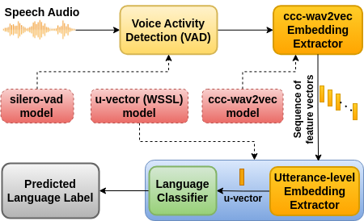
</p>

# Prerequisites #

## Platform ##
- Operating System: Ubuntu 22.04
- Python: python >= 3.8 (make sure the default python is python3)

## The list of imported libraries ##

### Common libraries to all Python scripts
- sys
- os
- matplotlib
- glob
- argparse
- shutil
- random
- datetime
- numpy
- torch
- torchaudio
- sklearn
- transformers
- fairseq
- silero-vad

### GUI Specific Libraries
- tkinter
- pygame
- soundfile
- sounddevice
- queue
- threading

## Libraries Installation

#### To install the required libraries, run:

```bash
pip install scikit-learn matplotlib pygame tk transformers fairseq pandas tensorboardX sounddevice soundfile silero-vad
```


#### To install additional packages required by the ccc-wav2vec model:

- To install data2vec-aqc packages.

```bash
git clone https://github.com/Speech-Lab-IITM/data2vec-aqc
cd data2vec-aqc
pip install --editable ./
```

- To install torchaudio-augmentations packages.

```bash
git clone https://github.com/Speech-Lab-IITM/torchaudio-augmentations
cd torchaudio-augmentations
pip install --editable ./
```

##### Note:  ***torch*** and ***torchaudio*** are not explicitly included in the installation commands as they will be installed as dependencies. If not, install them separately.


# Description

This section provides the detailed information about this repository structure. This repository contains the following files and directories.

## Files

- ***ccc_wav2vec_extractor.py*** : It contains the codes for extracting the ccc-wav2vec embedding of the given audio files. It loads the ccc-wav2vec model from *model* directory. This model is the SPRING-INX foundation model taken from SPRING Lab of IIT Madras. It can be downloaded from [here](https://asr.iitm.ac.in/SPRING_INX/models/foundation/SPRING_INX_ccc_wav2vec2_SSL.pt) and save it in the *model* directory.

- ***demo_uvector_wssl.py*** : This is the CLI Python script. It takes audio file or a directory of audio files as a command line argument input and classify the language of the audio file. It also shows the classification probabilities of each language. In case of a command line argument as a directory of audio files, it generates a csv file as output which contains the path of audio file and predicted language label. 

- ***demo_uvector_wssl_with_label.py*** : This is also the CLI Python script similar to previous one. It takes a directory of audio files or a csv file as a command line argument input and classify the language of the audio file. It generates a csv file as output which contains the path of audio file, actual language label of audio file, and predicted language label. The command line argument input such as the directory of audio files or a csv file must follow the specified structure/format.

The audio files in the directory should follow the below structure so that the actual language label taken from the directory/folder name.<br>
  <root_dir/Input_dir\><br>
   ├── asm<br>
   │&nbsp; &nbsp;&nbsp;   └── audio_as.wav<br>
   ├── ben<br>
   │&nbsp; &nbsp;&nbsp;   └── bn_9.wav <br>
   ├── eng<br>
   │&nbsp; &nbsp;&nbsp;   └── test_en.wav <br>
   ├── guj<br>
   │&nbsp; &nbsp;&nbsp;   └── Gujarati_4.wav <br>
   ├── hin<br>
   │&nbsp; &nbsp;&nbsp;   └── hi_9.wav <br>
   ├── kan<br>
   │&nbsp; &nbsp;&nbsp;   └── KN4.wav <br>
   ├── mal<br>
   │&nbsp; &nbsp;&nbsp;   └── ml_9.wav <br>
   ├── mar<br>
   │&nbsp; &nbsp;&nbsp;   └── mr_9.wav <br>
   ├── odi<br>
   │&nbsp; &nbsp;&nbsp;   └── or_9.wav <br>
   ├── pun<br>
   │&nbsp; &nbsp;&nbsp;   └── pa_9.wav <br>
   ├── tam<br>
   │&nbsp; &nbsp;&nbsp;   └── tamil_5.wav <br>
   └── tel<br>
   &nbsp; &nbsp; &nbsp;&nbsp;   └── telgu_5.wav  <br>


The csv file in the command line argument should follow the below structure.<br>
Structure of CSV file: <br>
<Path_of_wav_audio_file\>,<actual_language_label\>

e.g., /foo/foo1/asm/audio_as.wav,asm <br>
&nbsp;&nbsp;&nbsp;&nbsp;&nbsp;&nbsp;&nbsp;&nbsp;/foo/foo1/ben/bn_9.wav,ben <br>


- ***demo_uvector_wssl_gui.py*** : This is the GUI Python script. It helps in language classification of recorded speech. There is a functionality to record a speech, save it in a *recorded_audio* directory, and then we can classify the language. The language classification is not limited to recorded audio, but we can select any audio through file manager and classify the language label. In this GUI, we can also listen the recorded/pre-existing audio with play/pause functionalities. It is depended on ***demo_uvector_wssl.py*** Python script.

- ***sound.py*** : This code is the part of *demo_uvector_wssl_gui.py*. It provides the audio recording functionality.

- ***Readme.md*** : It contains the detailled information about this repository.

- ***Acknowledgements.md*** : It contains the acknowledgement.


## Directories

- ***torchaudio-augmentations*** : It is the cloned directory of *torchaudio-augmentations* package. We need to install it as it is required in ccc-wav2vec embedding extraction. *torchaudio-augmentations.zip* file is also added in case *torchaudio-augmentations* repository can not be cloned or have installation errors in present package. You can remove the present package/directory of *torchaudio-augmentations* and unzip *torchaudio-augmentations.zip* file and follow the installation process. 

- ***data2vec-aqc*** : It is the cloned directory of *data2vec-aqc* package. We need to install it as it is required in ccc-wav2vec embedding extraction. *data2vec-aqc.zip* file is also added in case *data2vec-aqc* repository can not be cloned or have installation errors in present package. You can remove the present package/directory of *data2vec-aqc* and unzip *data2vec-aqc.zip* file and follow the installation process. 

- ***model*** : It contains all the models. *SPRING_INX_ccc_wav2vec2_SSL.pt* is the ccc-wav2vec embedding extraction model. Since the model size is large, it is not included in the repository. It can be downloaded from [here](https://asr.iitm.ac.in/SPRING_INX/models/foundation/SPRING_INX_ccc_wav2vec2_SSL.pt) and saved it in the ***model*** directory. The other models are the u-vector model used in the language classification.

- ***recorded_audio*** : It stores a recently recorded audio. 

- ***features*** : It stores the ccc-wav2vec embedding in *.npy* format of a recently classified audio.

- ***classified_audio/unclassified_audio*** : It stores a copy of the correctly/wrongly classified audio, respectively. When we perform the classification using GUI, a confirmation window appears. It ask the user confirmaton that classified language is correct or not. Based on the user confirmation, an audio file is copied into the respective directory.


# Features

## CLI Python Script
- It can classify one and multiple audio files. The multiple files should be stored in a directory and path of this directory should be given as command line argument to classifile these multiple files.
- It generates a csv file as output which contains the path of audio files and classified language label. This can be used for further analysis and benchmarks.
- It also shows the classification probabilities for all languages as a bar chart plot for each files a directory. 

## CLI Python Script with Label
- It classifies the multiple audio files. It can take csv file or a directory as a command line argument. The csv file contains the path of audio files and actual language label. In case of directory the language label is taken from the directory name. So, It is important to maintain the proper directory structure as shown above.
- It also generates a csv file as output which contains the path of audio files, actual label, and classified language label. This can be used for further analysis and benchmarks.
- It also shows the classification probabilities for all languages as a bar chart plot for each files a directory.
- It generates a ***Result.txt*** file which stores the performance merics after the end of classification task.


## GUI Python Script
The GUI window provide options for recording audio, playing saved audio, and identifying the language using u-vector with WSSL models.

#### 1. Recording the speech audio

##### (i) Start Recording
 First click on the "Start Recording" button and then press the "OK" button to start the recording of speech audio using the microphone.

<p float="left">
  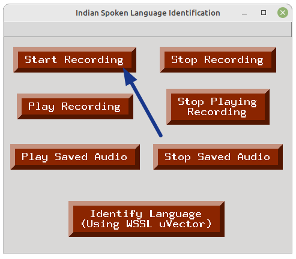
  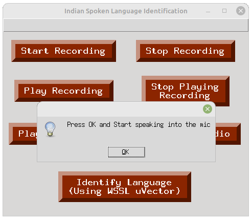
</p>

##### (ii) Stop Recording
To stop the ongoing audio recording, click on the "Stop Recording" button. The recording will be stopped immediately. Then click on the "OK" button. After this, the next window will show the message regarding the location of saved recorded audio. You need to choose this audio when you will perform the language identification.
<p float="left">
  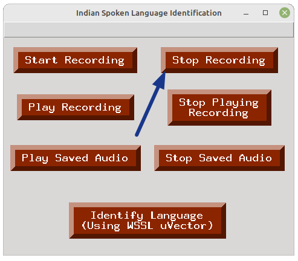
  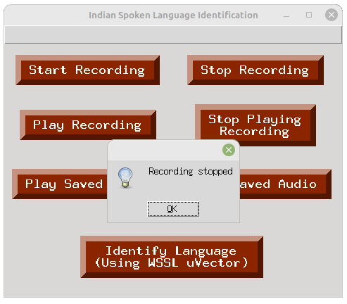
  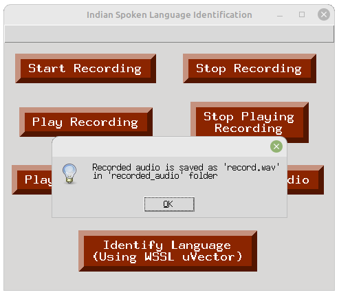
</p>

##### (iii) Play Recording
If you want to liesten the recorded audio, you can do it by pressing the "Play Recording" button.
<p float="left">
  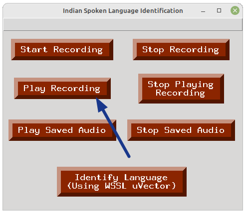
</p>

##### (iv) Stop Playing Recording
If you want to stop playing the recorded audio in between, you can do it by pressing the "Stop Playing Recording" button.
<p float="left">
  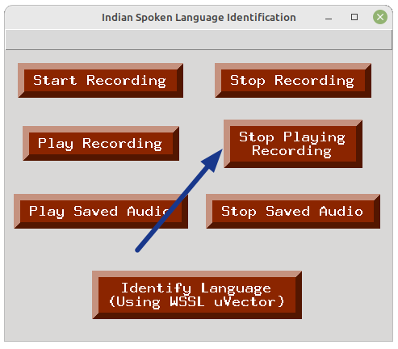
</p>

#### 2. To check the saved speech audio
You can check the saved audio by playing the saved audio. Click on the "Play Saved Audio" button and then choose the audio file using opened file manager. After selecting the audio file, the audio will be played. You can also stop playing the audio any time by clicking the "Stop Saved Audio" button.

<p float="left">
  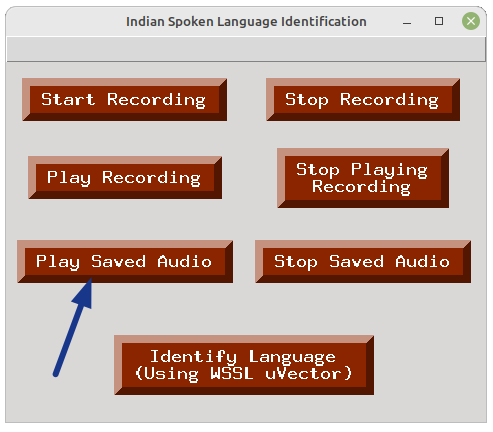
  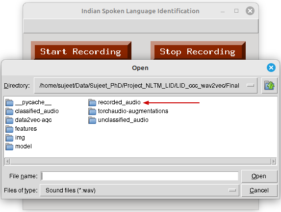
  
</p>

#### 3. Language Identification: 

We have u-vector with WSSL model to perform the language identification task. We need to click "Identify Language (Using WSSL uVector)" to perform the language identification.
<p float="left">
  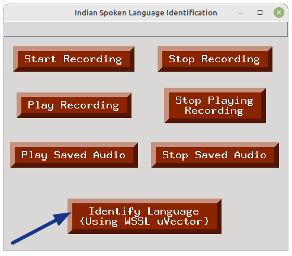
</p>

After clicking it, we need to select an audio file. We can select the recorded audio from the "recorded_audio" directory. We can also choose another saved audio file using the open file manager.
<p float="left">
  
</p>

After selecting the audio file, the predicted language will show on the message window. This window will also ask the user for the feedback that predicted language is correct or not. Based on the user feedback, this audio file will be copied to "classified_audio" or "unclassified_audio" directory if prediction is correct or wrong, respectively.
<p float="left">
  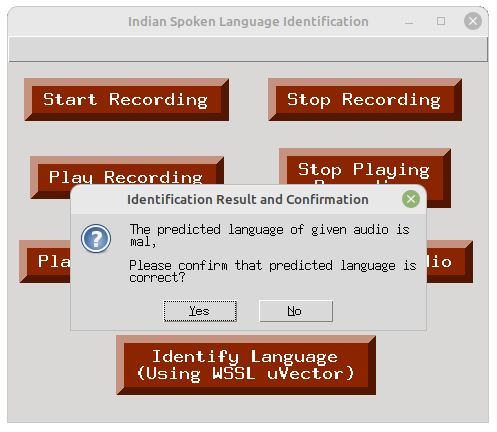
</p>

Later, a bar graph will display the predicted probabilities of all languages.
<p float="left">
  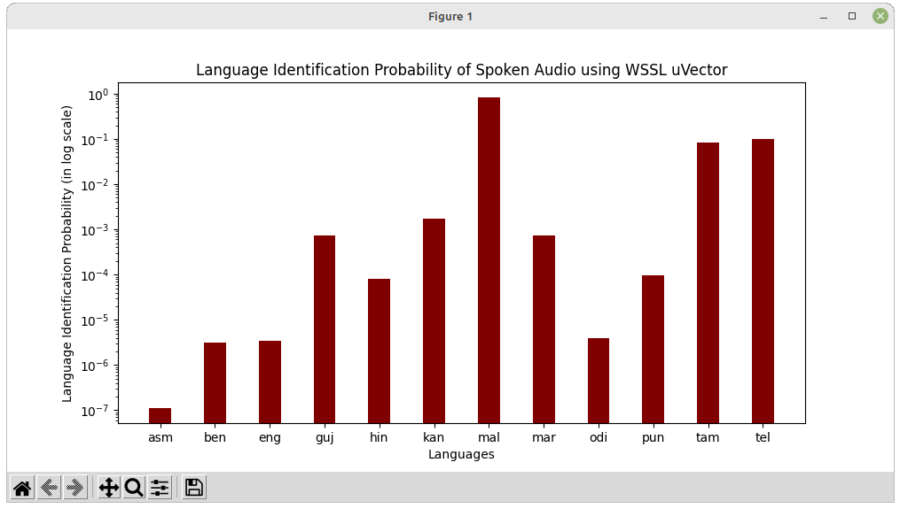
</p>

#### 4. Results and Confirmation

- After language identification, the predicted language is displayed, and a confirmation message box appears. The user can confirm or deny the predicted language.
- If confirmed, the audio file is copied to the corresponding language directory under the `classified_audio` directory with filename containing current timestamp.
- If denied, the audio file is also copied to the `unclassified_audio` directory with filename containing current timestamp.


# Running the Scripts

### 1. Clone the repository:

```bash
git clone https://github.com/NLTM-LID/LID-version-2.0.git
cd "LID-version-2.0"
```

### 2. To run CLI Python script
```bash
python demo_uvector_wssl_with_label.py <path_to_audio_file_or_directory>
```

### 3. To run CLI Python script with label
```bash
python demo_uvector_wssl_with_label.py <path_of_csv_file_or_path_of_directory_contains_audio_files>
```

### 4. To run GUI Python script
```bash
python demo_uvector_wssl_gui.py
```


# Limitation
These models are trained on speech datasets taken from (i) the 2000 hours SPRING Lab data of 10 languages (does not contain English and Telugu), (ii) English 190 hrs data from NLTM Pilot and NPTEL Curated Data from SPRING Lab, and (iii) Telugu data is taken from AI4Bharat dataset. These datasets do not cover all possible types of speech such as dialects, accents, channels, and domains. Therefore, these models may fail in the following conditions.

- Presence of unfamiliar dialects and accents.
- Presence of high domain mismatch.
- Contains too much noise and unclear speech.

# Acknowledgement

This work is performed with the support of the project named "Speech Technologies In Indian Languages". It is part of the NLTM (National Language Technology Mission) consortium project which is sponsored by Meity (Ministry of Electronics and Information Technology), India. The copyrights for this code belong to IIT Mandi and IIT Dharwad.


# License

This project is licensed under the NLTM License - see the [LICENSE](LICENSE) file for details.

